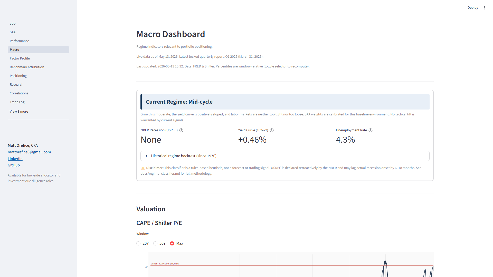

# Investment Analytics Tracker

Multi-asset portfolio analytics with institutional-grade performance attribution, factor regression, and macro regime monitoring.

**Live demo:** [mattorefice-investment.streamlit.app](https://mattorefice-investment.streamlit.app/) &nbsp;·&nbsp;  &nbsp;·&nbsp; [](https://github.com/MattOrefice/investment-tracker/actions/workflows/live-data.yml)

Built by [Matt Orefice, CFA](https://www.linkedin.com/in/matthew-orefice-cfa-83536b190/).
Available for buy-side allocator and investment due diligence roles.

---



*Macro Dashboard — regime classification with dynamic interpretations of CAPE, ECY, yield curve, credit spreads, labor, and growth indicators against historical percentile bands.*

---

## Current Snapshot

*Prices update daily. Snapshot as of June 10, 2026 (405 calendar days since inception May 1, 2025).*

| Metric | Value | Window |
|--------|-------|--------|
| Cumulative TWR | +31.9% | Since Inception |
| vs. Custom Blended SAA Benchmark | +209 bps | Since Inception |
| vs. S&P 500 | −67 bps | Since Inception |
| YTD 2026 Return | +12.3% (S&P 500: +7.7%) | Jan 1 – Jun 10, 2026 |
| Sharpe Ratio | 2.00 | Since Inception, annualized (RF: 4.5%) |
| Information Ratio | 1.24 | Since Inception, vs. Custom Blended |
| Q1 2026 Active Return | +188 bps vs. blended; +713 bps vs. S&P 500 | Q1 2026 (locked) |

The primary benchmark is the custom SAA-blended basket, not the S&P 500. A small SI shortfall against the S&P 500 is an expected outcome for a portfolio whose 78% equity sleeve closely mirrors broad market beta with modest factor tilts, while the diversifying non-equity sleeves dampen returns during a strong equity tape. See [Methodology](#methodology) for return computation and benchmarking details.

---

## Methodology

- **SAA as policy.** 10-sleeve strategic asset allocation serves as the policy benchmark; deviations are measured as drift and corrected via the Capital Deployment workflow.

- **Performance attribution.** Brinson-Hood-Beebower decomposition partitioning excess return into allocation and selection effects against a SAA-target-weighted blended benchmark.

- **Factor regressions.** Per-sleeve Fama-French 5-factor regressions with Newey-West HAC standard errors. Regional sleeves use region-appropriate factor universes (Ken French Developed ex-US for international developed).

- **Macro regime classification.** Rules-based classifier using NBER USREC, 10Y-2Y curve, and unemployment rate. Dynamic interpretations derive from live FRED data rather than static commentary.

- **Tax-aware accounting.** Lot-level inventory with DRIP inheritance, harvest candidate identification, and trade log normalization.

- **Candidate asset evaluation.** Univariate statistics (annualized return, vol, Sharpe, drawdown, skew, kurtosis), full-sample and rolling correlations against SAA sleeves, regime-conditional correlation by NBER cycle phase, mean-variance contribution (unconstrained and constrained), and a decision framework that surfaces allocator-side considerations (liquidity, tax treatment, operational complexity, mandate fit) rather than reducing the decision to a single Sharpe-improvement number.

### Returns

Daily-linked TWR chains sub-period returns as `TWR = ∏(1 + r_t) − 1`, where `r_t = (V_t − V_{t−1} − CF_t) / V_{t−1}`. Cash flows are treated at the beginning of each period. For the lump-sum single-deposit case, daily-linked TWR and Modified Dietz converge within 1 basis point — verified by an identity test in the suite.

### Brinson-Fachler Attribution

Active return is decomposed per sleeve into allocation effect `(w_p − w_b)(r_b − r_b,total)` and selection effect `w_p(r_p − r_b)`. Allocation effect captures sleeve weighting decisions relative to the SAA-blended benchmark; selection effect captures holding-vs-benchmark performance within each sleeve. The two effects sum to total active return within 1 basis point, enforced by an algebraic identity test.

### Per-Sleeve Fama-French 5-Factor Regression

Each equity sleeve is regressed against its region-appropriate FF5 factor set — US factors (Ken French Data Library) for the US equity sleeves (VOO, SPHQ, VTV, AVUV), Developed ex-US factors for the international sleeve (VEA). Per-sleeve regressions avoid the model misspecification that arises when non-US and real-asset returns flow into a single full-portfolio alpha estimate. Newey-West HAC standard errors (lag = ⌊4 × (T/100)^(2/9)⌋) correct for heteroskedasticity and serial correlation.

### Custom-Benchmark Attribution Regression

Portfolio excess returns are regressed on the custom SAA-blended benchmark return plus HML, SMB, and RMW style factors. The regression intercept is the active return component unexplained by benchmark beta or factor tilts — the institutional alpha definition used by PRINCO and JPM IDD. CMA is excluded; for a passive/semi-passive multi-ETF implementation it captures ETF-level capex differences rather than deliberate active tilts.

### Equity Style Box

The style box approximates Morningstar's factor placement using four trailing valuation metrics (book-to-price, earnings-to-price, dividend yield, cash-flow-to-price), each normalized as a fractional deviation from SPY. Size is log₁₀(weighted-average market cap in $B), calibrated so SPY anchors at the Large/Blend center. Coverage is US equity ETFs only (VOO, VTV, SPHQ, AVUV); non-US holdings are excluded with a disclosure note referencing regional style box methodology.

### Asset Evaluation Framework

Evaluates prospective asset additions using marginal Sharpe contribution, drawdown sensitivity, and correlation analysis relative to the existing 10-sleeve SAA. The framework separates sample-period arithmetic (unreliable for volatile, regime-shifting assets) from forward-looking properties, and produces a structured decision conclusion with explicit arguments for and against inclusion. Bitcoin is the current case study.

### Macro Panel

Tracks four indicators — Shiller CAPE (with implied 10-year real return r ≈ −0.070 × ln(CAPE/16) + 0.066), yield curve (10Y−2Y), Fed Funds Rate, and ICE BofA HY OAS — via FRED integration with a 24-hour SQLite cache. Each indicator includes historical percentile context relative to the available data window. A rules-based regime classifier summarizes the combined macro environment relative to SAA positioning.

### Integrity Testing

Three layers: (1) math identities that must hold by construction (BF effects sum to active return, sleeve weights sum to 100%, TWR equals absolute return for the lump-sum case); (2) reasonability bounds with tolerance (Sortino ≥ Sharpe, VaR/CVaR within expected range, IR × TE within Jensen's gap); (3) prose-vs-data guards asserting that every numerical citation in interpretive text derives from its source computation, not from a hardcoded constant. All three layers run on every push via GitHub Actions — the per-push run reports 865 passed / 48 skipped / 35 deselected on the Linux runner (the 48 skips are platform-gated render/PDF tests that pass locally on Windows; the full suite is 913).

### Data Sources

| Source | Series | Caching |
|--------|--------|---------|
| Yahoo Finance | Daily adjusted-close (all holdings and benchmarks) | SQLite; locked on quarterly report date to prevent retroactive revisions |
| FRED | T10Y2Y, DFF, BAMLH0A0HYM2 (HY OAS), USREC | SQLite, 24-hour TTL |
| Robert Shiller / Yale | CAPE (monthly) | Local CSV, monthly refresh |
| Ken French Data Library | FF5 factors (US, Developed ex-US), UMD momentum | Downloaded and cached per regression run |

**Real Assets benchmark disclosure.** The portfolio holds PDBC (C-corp structure, no K-1 issued); the benchmark uses DBC (K-1-issuing). Selection effect in the Brinson-Fachler table captures the DBC–PDBC return spread. This asymmetry is documented rather than hidden. Real Assets sleeve is benchmarked as a 60% VNQ / 40% DBC blend; REITs are weighted higher than commodities because broad commodity futures carry negative roll yield in contango regimes that suppresses long-run total return.

**Implementation note.** This dashboard is a model strategic asset allocation used to exercise the analytical framework. The author's brokerage account holds a subset of these positions; full SAA implementation is ongoing. Analytics treat the SAA as fully implemented at target weights for purposes of attribution and benchmarking.

---

## Implementation

- **Stack:** Python 3.11, Streamlit, pandas, NumPy, statsmodels, plotly, SQLite
- **Data sources:** FRED API (macro), Ken French Data Library (factors), Shiller / Yale (CAPE), yfinance (prices)
- **Test coverage:** 913 unit and integration tests covering return calculation, attribution math, factor regression plumbing, and dynamic-interpretation guards
- **Deployment:** Streamlit Community Cloud, redeploy on push to main

Technical architecture documented in [docs/architecture.md](docs/architecture.md).

Core logic resides in `src/` with no Streamlit imports, making it fully unit-testable. Streamlit pages in `pages/` are auto-discovered by `app.py`. Price data is cached in SQLite to avoid repeated Yahoo Finance API calls. PDF reports are assembled via Jinja2 templates and rendered through WeasyPrint on Linux/Cloud.

## Repository structure

- `app.py` — landing page and entry point
- `pages/` — 12 analytical pages (SAA, Performance, Macro, Factor Profile, Benchmark Attribution, Correlations, Tax Lots, Capital Deployment, and others)
- `src/` — analytical modules (attribution, regression, macro, drip, rebalance, interpretations)
- `tests/` — pytest suite
- `templates/` — Jinja2 HTML and CSS for quarterly PDF report
- `docs/` — methodology documentation, phase notes, operational runbooks

```
src/
  attribution.py        Brinson-Fachler decomposition, two-stage reconciliation
  benchmarks.py         SAA-blended benchmark, per-sleeve benchmark series
  factors.py            FF5 regressions, benchmark-relative regression, style box
  holdings.py           Net shares, portfolio value series, sleeve weights
  macro.py              FRED integration (yield curve, Fed Funds, HY OAS, USREC)
  prices.py             Yahoo Finance fetcher with SQLite cache
  reports.py            PDF generator: data assembly, Jinja2 render, WeasyPrint
  returns.py            Daily-linked TWR, Modified Dietz, annualization, period slicing
  shiller.py            CAPE from Yale dataset with local CSV fallback

pages/
  1_SAA.py              SAA allocation chart, per-sleeve rationale
  2_Performance.py      TWR, BF attribution, cumulative chart, drift, FI duration, PDF export
  3_Macro.py            CAPE, yield curve, Fed Funds, HY OAS, regime classifier
  4_Factor_Profile.py   Per-sleeve FF5 regressions, benchmark-relative alpha, equity style box
  5_Asset_Evaluation.py  Bitcoin case study: marginal Sharpe, drawdown, decision framework
  6_Benchmark_Attribution.py  Custom-benchmark regression
  8_Research.py         ETF selection: benchmark vs. holding, ER breakdown
  9_Correlations.py     Rolling sleeve correlation matrix
  10_Trade_Log.py       Trade entry, investment/position thesis browser, themes
  11_Capital_Deployment.py  Contribution allocation and band-breach rebalancing
  12_Tax_Lots.py        Lot-level cost basis, holding period, harvest candidates

templates/              PDF report (Jinja2 HTML + CSS)
tests/                  913 tests across three integrity layers
docs/                   Methodology diagnostics, phase notes, operational runbooks
```

---

## Running Locally

```bash
git clone https://github.com/MattOrefice/investment-tracker.git
cd investment-tracker
python -m venv .venv

# macOS / Linux
source .venv/bin/activate

# Windows (PowerShell)
.\.venv\Scripts\Activate.ps1

pip install -r requirements.txt

# Run the demo (paper-trade portfolio, no real holdings required)
TRACKER_MODE=demo streamlit run app.py           # macOS / Linux
$env:TRACKER_MODE="demo"; streamlit run app.py   # Windows PowerShell
```

To generate a quarterly PDF: open the demo, navigate to **Performance**, and click **Generate Quarterly Report**. WeasyPrint is used on Linux/Cloud; xhtml2pdf is the fallback on Windows.

To run the test suite:

```bash
TRACKER_MODE=demo python -m pytest    # macOS / Linux
$env:TRACKER_MODE="demo"; python -m pytest  # Windows PowerShell
```

Slow and live-data tests are excluded via `pytest.ini` (`addopts = -m "not slow and not live_data"`). Do not pass a CLI `-m` — it replaces that default and silently re-includes the live external-API tests. To run the live-data integration tests deliberately: `python -m pytest -m "live_data"`.

The personal portfolio (`TRACKER_MODE=personal`, `data/tracker.db`) is gitignored and exists locally only. The demo portfolio (`data/demo.db`) is committed and is what the Streamlit Cloud deployment uses.

---

## CI/CD

GitHub Actions runs `python -m pytest` under `TRACKER_MODE=demo` on every push and pull request to `main`; the run reports 865 passed / 48 skipped / 35 deselected on the Linux runner in approximately 90 seconds (the 48 skips are platform-gated render/PDF tests that pass locally on Windows; the full suite is 913). Slow and live-data tests are excluded via `pytest.ini`, so no external API calls run on PRs. A separate scheduled workflow (`.github/workflows/live-data.yml`, daily plus manual dispatch) runs only the live-data integration tests against the live Ken French and Yahoo endpoints, so ingestion-contract coverage stays decoupled from PR gating. See `docs/ci_setup.md` for branch protection and secrets configuration.

---

## Disclaimer

The in-report legal disclaimer is defined as `REPORT_DISCLAIMER` in `src/reports.py` and is rendered on the final page of every generated PDF. This system is a personal investment analytics project provided for informational and educational purposes only. Nothing in this project constitutes investment advice, a recommendation to buy or sell any security, or an offer to provide advisory services.

---

## License

MIT. See `LICENSE`.

---

## Author

Matt Orefice, CFA (April 2026). Former Investment Data Analyst II at MissionSquare Retirement. Contact via [LinkedIn](https://www.linkedin.com/in/matthew-orefice-cfa-83536b190/).
